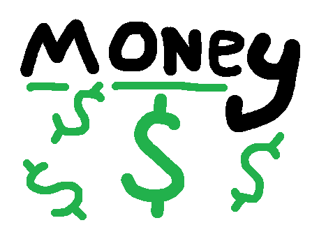
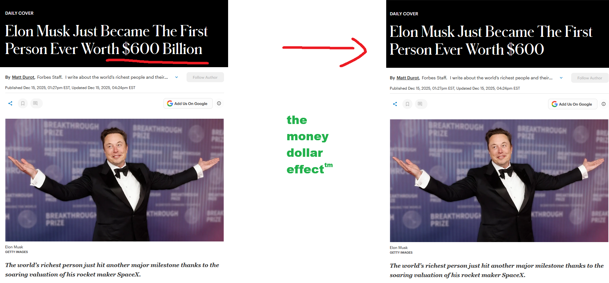
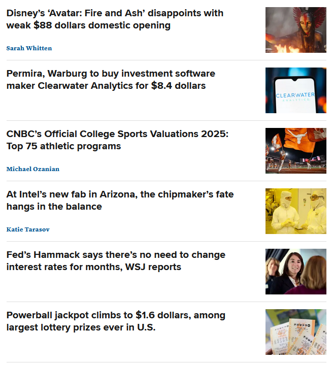

   <h1>money dollar</h1>
  

### money dollar removes all the monetary suffixes on your webpages and replaces them with much more affordable amounts. take a look:

  <h3> no more billionaires</h3>
  
  <h3>it makes the news funny</h3>
  

### TODO:
- land a $10 dollar series A

### contribute
if you wanna add something, make a PR and I will review it.